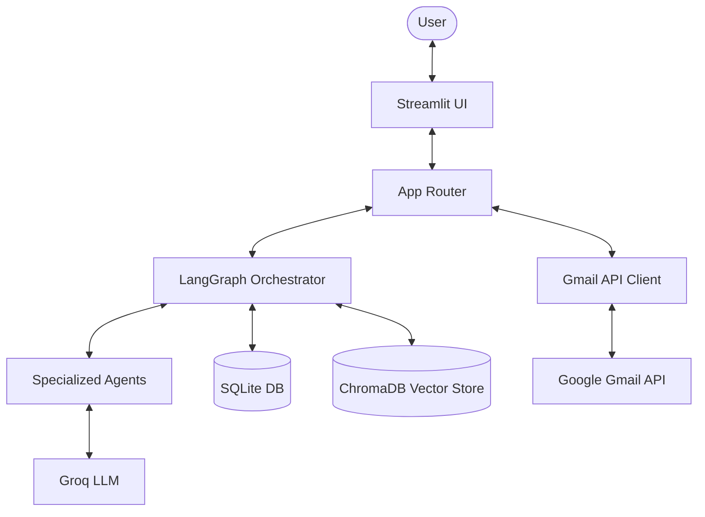

# 🤖 AI Inbox Copilot
### Multi-Agent AI Inbox Orchestrator & Conversational Assistant

AI Inbox Copilot is a local Multi-Agent AI Email Assistant that reads, classifies, prioritizes, searches, summarizes, and drafts replies for Gmail inboxes. Built using Streamlit, LangGraph, Groq, SQLite, and ChromaDB, it presents a clean chat interface to query, organize, and automate your inbox while maintaining a human-in-the-loop approval workflow.

---

## ⚡ Features

- **🔐 Gmail OAuth Integration**: Secure Google login using OAuth 2.0.
- **🔄 Incremental Syncing**: Automatically fetches and embeds new emails using checkpointing.
- **🚨 Priority & Category Detection**: AI automatically routes emails into categories and assigns priority levels (High, Medium, Low).
- **📋 Task & Meeting Extraction**: Pulls actionable tasks and calendar schedules directly from email bodies.
- **✍️ Human-in-the-Loop Drafts**: Auto-generates draft replies based on user preference memory, staging them for manual review, edit, or approval.
- **🔍 Semantic & Hybrid Search**: Search emails based on context and meaning via ChromaDB vector embeddings.

---

## 🏗️ Architecture & System Design



---

## 🛠️ Tech Stack

- **Frontend**: [Streamlit](https://streamlit.io/)
- **Orchestrator**: [LangGraph](https://github.com/langchain-ai/langgraph)
- **Language Models**: [Groq API](https://groq.com/) (Llama-3 models)
- **Relational Cache**: SQLite (via SQLAlchemy ORM)
- **Vector Database**: [ChromaDB](https://www.trychroma.com/)
- **Embeddings**: Local HuggingFace `SentenceTransformers` (`all-MiniLM-L6-v2`)
- **Email Access**: [Gmail REST API](https://developers.google.com/gmail/api)

---

## 📁 Folder Structure

```
project-root/
├── app/                        # Application Source Code
│   ├── agents/                 # LangGraph workflow and agent nodes
│   ├── database/               # SQLite database schemas and CRUD setup
│   ├── gmail/                  # OAuth authorization and Gmail API client
│   ├── memory/                 # User preference memory manager
│   ├── rag/                    # ChromaDB clients and utilities
│   ├── services/               # Shared external APIs (Groq wrapper)
│   ├── tools/                  # Custom tools invoked by agents
│   └── ui/                     # Custom Streamlit styles and design tokens
├── .env                        # Local environment variables
├── .gitignore                  # Git ignore definitions
├── credentials.json            # Google OAuth Client configuration (git-ignored)
├── Dockerfile                  # Docker container configuration
├── docker-compose.yml          # Docker Compose multi-container orchestrator
├── emails.db                   # SQLite database file (git-ignored)
├── main.py                     # Entrypoint script
└── requirements.txt            # Python dependencies
```

---

## 🗄️ Database Design

The local SQLite schema stores the relational states:
- `users`: Registered users metadata.
- `emails`: Caches messages, subjects, senders, and category/priority classifications.
- `email_threads`: Groups messages by conversation thread.
- `tasks`: Action items and deadlines extracted from email text.
- `meetings`: Structured calendar meetings.
- `drafts`: staged replies waiting for approval (`pending_approval`, `sent`, `rejected`).
- `memories`: Learned user preferences and styles.
- `agent_actions`: Audit logs for agent tracking.

---

## 🚀 Installation & Setup

### Prerequisites
- Python 3.10+ (for local run) or Docker / Docker Compose
- Google Cloud Console Project with the **Gmail API** enabled.
- A **Groq Cloud API Key**.

### Local Setup

#### Step 1: Clone and Prepare
```bash
git clone https://github.com/bittush8789/ai-inbox-copilot.git
cd ai-inbox-copilot
```

#### Step 2: Virtual Environment & Packages
```bash
python -m venv venv
# Windows:
.\venv\Scripts\Activate.ps1
# macOS/Linux:
source venv/bin/activate

pip install -r requirements.txt
```

#### Step 3: Secrets Setup
1. Create a `.env` file in the root directory:
   ```env
   GROQ_API_KEY=your_groq_api_key_here
   ```
2. Place your downloaded desktop app client credentials as `credentials.json` in the root folder.

#### Step 4: Run Application
```bash
streamlit run main.py
```
Open `http://localhost:8501`, log in using the **Link** button, and synchronize your inbox.

### Docker Setup

Alternatively, you can run the application inside a Docker container.

1. Ensure `.env` (with `GROQ_API_KEY`) and `credentials.json` are present in the project root directory.
2. Build and start the container:
   ```bash
   docker-compose up --build -d
   ```
3. View logs to monitor startup or agent actions:
   ```bash
   docker-compose logs -f
   ```
4. Open `http://localhost:8501` in your browser to access the application dashboard.
5. Stop the container using:
   ```bash
   docker-compose down
   ```

---

## 📄 License

Distributed under the MIT License. See `LICENSE` for details.
