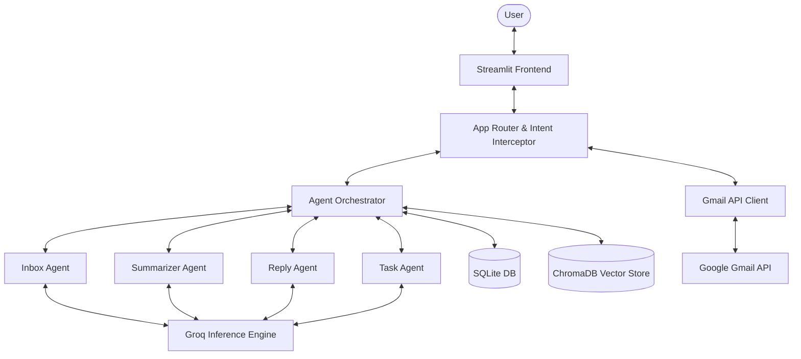
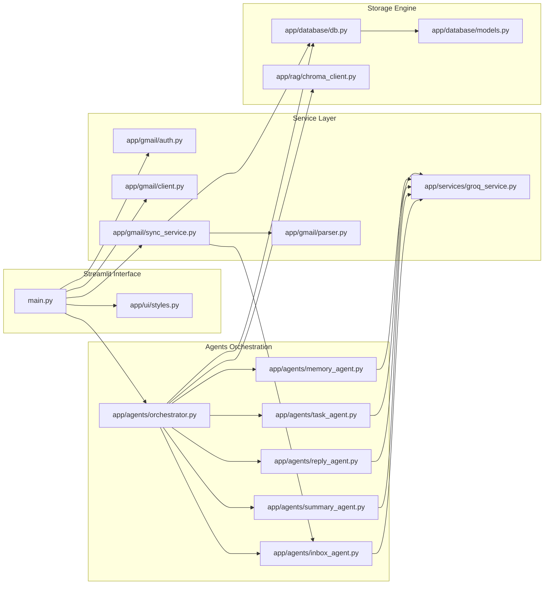
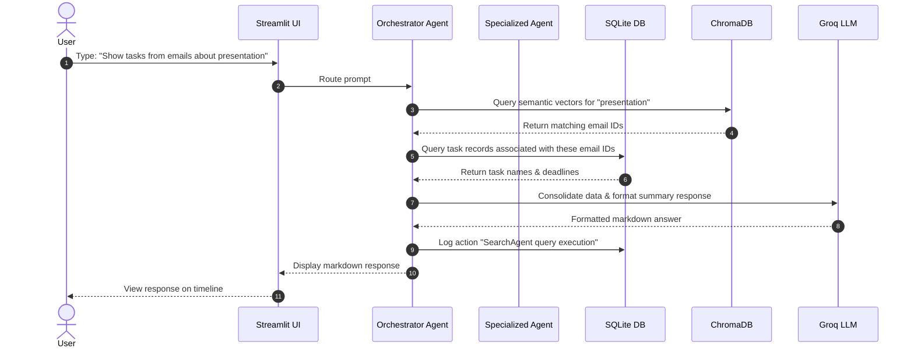
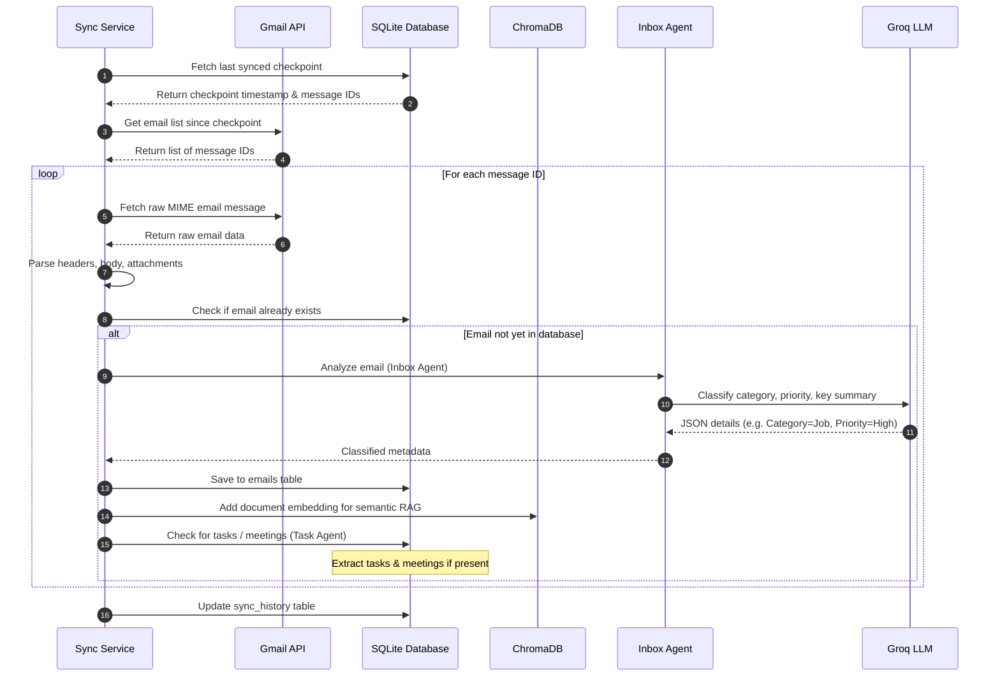
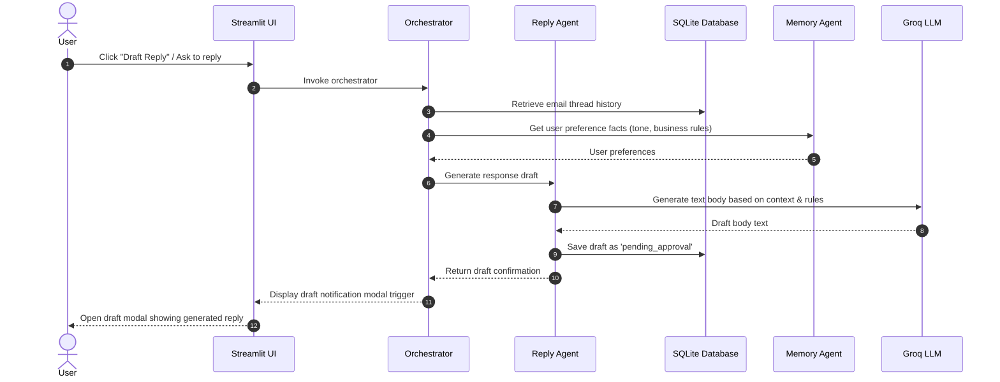
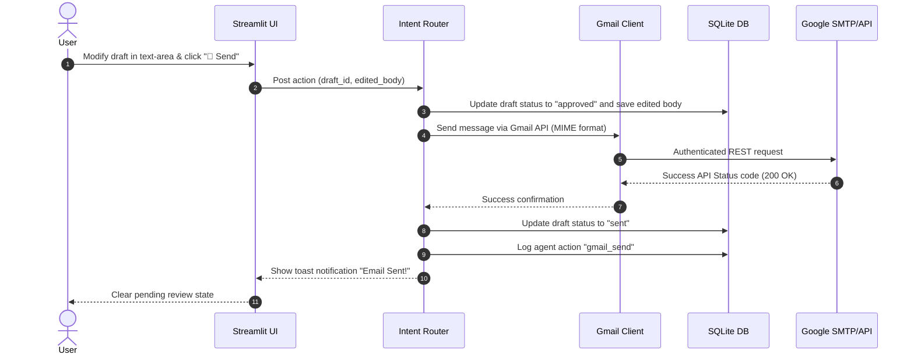
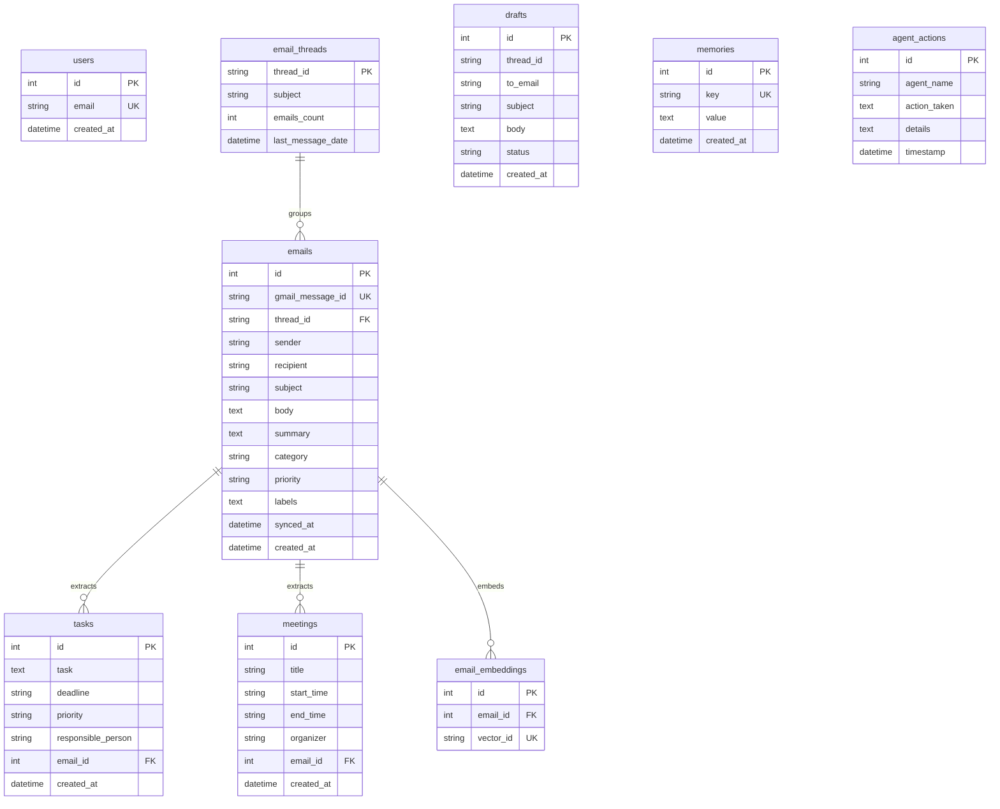

# 🤖 AI Inbox Copilot
### Enterprise-Grade Multi-Agent AI Inbox Orchestrator & Conversational Assistant

[](https://opensource.org/licenses/MIT)
[](https://www.python.org/)
[](https://streamlit.io/)
[](https://www.langchain.com/)
[](https://groq.com/)
[](https://sqlite.org/)
[](https://www.trychroma.com/)

AI Inbox Copilot is a local portfolio-grade Multi-Agent AI Email Assistant that reads, classifies, prioritizes, searches, summarizes, and drafts replies for Gmail inboxes. Built with Streamlit, LangChain, Groq, SQLite, and ChromaDB, it functions like **ChatGPT + Gmail + AI Agents**, presenting a clean single-page chat room to query, organize, and automate your inbox while keeping a human-in-the-loop for approvals.

---

## 📖 Table of Contents
1. [Project Overview](#project-overview)
2. [Problem Statement](#problem-statement)
3. [Solution](#solution)
4. [Features](#features)
5. [Architecture Overview](#architecture-overview)
6. [System Design](#system-design)
    - [High-Level Architecture](#high-level-architecture)
    - [Component Diagram](#component-diagram)
    - [Request Flow](#request-flow)
    - [Email Synchronization Flow](#email-synchronization-flow)
    - [AI Reply Generation Flow](#ai-reply-generation-flow)
    - [Gmail Send Email Flow](#gmail-send-email-flow)
7. [Tech Stack](#tech-stack)
8. [Folder Structure](#folder-structure)
9. [Database Design](#database-design)
    - [Entity-Relationship Diagram](#entity-relationship-diagram)
    - [Database Schemas](#database-schemas)
10. [AI Agents System](#ai-agents-system)
    - [Inbox Summarizer Agent](#inbox-summarizer-agent)
    - [Task Extraction Agent](#task-extraction-agent)
    - [Urgency Detection Agent](#urgency-detection-agent)
    - [Meeting Detection Agent](#meeting-detection-agent)
    - [Job Detection Agent](#job-detection-agent)
    - [Reply Generation Agent](#reply-generation-agent)
    - [Search Agent](#search-agent)
    - [Inbox Chat Agent](#inbox-chat-agent)
11. [API Design](#api-design)
12. [Security Architecture](#security-architecture)
13. [Installation Guide](#installation-guide)
14. [Environment Variables](#environment-variables)
15. [Docker Support](#docker-support)
16. [Testing Strategy](#testing-strategy)
17. [Performance Considerations](#performance-considerations)
18. [Future Roadmap](#future-roadmap)
19. [Screenshots](#screenshots)
20. [Deployment Readiness Checklist](#deployment-readiness-checklist)
21. [Contributing Guide](#contributing-guide)
22. [License](#license)

---

## 🌟 Project Overview

### What problem the product solves
Modern knowledge workers spend an average of 4.1 hours per day checking their email. The sheer volume of incoming messages results in cognitive overload, fragmented focus, and delayed responses. Important communications—such as job opportunities, time-sensitive invoices, calendar invites, and critical project updates—are easily lost in a flood of newsletters, transactional updates, and promotional spam.

### Why existing email workflows are inefficient
Existing email clients rely on primitive workflows:
- **Manual Folders/Labels**: Require users to constantly drag-and-drop messages, which breaks focus and is rarely maintained consistently.
- **Keyword Search**: Extremely brittle; searching for "invoice" might miss an email saying "here is the bill," and searching for "meeting" yields hundreds of irrelevant historical threads.
- **Unstructured Information**: Emails contain action items, dates, and contacts, but these remain locked in prose. Users must manually copy them to task managers, calendar apps, or CRM spreadsheets.
- **Delayed Replies**: Standard auto-responders look robotic, while drafting professional, context-rich replies manually takes minutes per message.

### How AI Inbox Copilot helps users manage Gmail
AI Inbox Copilot introduces a conversational, agentic layer on top of Gmail:
1. **Semantic Understanding**: It processes and catalogs email content beyond keywords, mapping meaning using embedding vectors.
2. **Autonomous Multi-Agent Analysis**: A battery of specialist LLM agents work in parallel to categorize, extract tasks, schedule meetings, detect job leads, and flag urgency.
3. **Conversational Interface**: Users can ask natural language questions (e.g., *"What is the status of the marketing presentation review?"* or *"Summarize today's urgent messages"*).
4. **Draft-Review Loop**: The system drafts replies using personalized memory and past email context, showing them in a beautiful UI for human modification, approval, or discarding.

---

## ⚠️ Problem Statement

Modern enterprise inbox management suffers from several major structural issues:

- **Email Overload**: The volume of incoming data exceeds human processing capabilities, causing communication bottlenecks.
- **Missed Critical Alerts**: A lack of smart prioritization means high-urgency client requests are treated with the same visual weight as low-value updates.
- **Manual Categorization**: Traditional filter rules are static, regex-based, and fail to understand semantic context (e.g., distinguishing between a billing problem vs. a receipt).
- **Slow Email Response Latency**: Delayed business communications lead to lost prospects, degraded client relationships, and delayed project velocity.
- **Buried Action Items**: Tasks and calendar events described in email text go unrecorded, resulting in missed deadlines and broken commitments.
- **Fragmented Context**: Finding historical interactions requires manual thread navigation, forcing users to stitch together communication histories mentally.

---

## 💡 Solution

**AI Inbox Copilot** acts as a virtual executive assistant directly embedded into your inbox. 

It connects to your Gmail via a secure OAuth portal, regularly synchronizes your messages, parses threads, and uses a collaborative multi-agent architecture to classify data and execute operations. By combining the structured querying capabilities of SQL databases with the semantic capabilities of vector stores (ChromaDB), it bridges the gap between raw emails and action-oriented intelligence.

```
       +------------------+
       |   Gmail Inbox    |
       +--------+---------+
                | (Secure OAuth Sync)
                v
  +-------------+-------------+
  |    AI Inbox Copilot       |
  |  +---------------------+  |
  |  | Multi-Agent Engine  |  | <---> ChromaDB (Semantic Vector Store)
  |  +---------------------+  |
  |  | SQLite Cache Engine |  | <---> Relational Data (Users, Threads, Tasks)
  |  +---------------------+  |
  +-------------+-------------+
                |
                v
  +-------------+-------------+
  |    Conversational UI      | <---> User reviews drafts, queries summaries,
  |    (Streamlit Web App)   |       and interacts with Copilot.
  +---------------------------+
```

---

## ⚡ Features

### 🔐 Gmail OAuth Integration
Integrates directly with Google's API Console using OAuth 2.0 Client credentials. It safely negotiates refresh tokens, enabling background synchronization and authenticated sending without ever asking for your primary Google account password.

### 🔄 Inbox Synchronization
Performs lightning-fast, incremental syncs. It uses local database checkpoints (`sync_history`) to identify which messages have already been parsed and embedded, fetching only new arrivals to minimize API quotas and bandwidth consumption.

### 📝 AI Email Summarization
Summarizes long, messy threads into concise, readable digests. It lists the main topics discussed, current decisions, and pending questions, giving you absolute clarity in seconds.

### 🚨 Urgent Email Detection
Applies natural language analysis to assess message tone and content. If a message contains tight deadlines, escalated issues, or high-value business, it tags it as **High Priority** and surfaces it directly to the dashboard.

### 📅 Meeting & Calendar Event Extraction
Scans incoming messages for dates, times, time zones, organizers, and topics. It parses these into structured database records (`meetings`) ready to be reviewed or synced.

### 💼 Job Opportunity Detection
Identifies recruiter emails, job descriptions, application confirmations, and scheduling requests, categorizing them and tracking roles and entities.

### 🧾 Invoice & Receipt Detection
Detects billing, subscriptions, invoices, and payments, extracting the amount, vendor, due date, and reference codes into structured database schemas.

### 💬 AI Inbox Chat
Provides a conversational room powered by an orchestrator agent. You can write custom queries like *"Did John send me the updated contract?"* or *"Draft a polite rejection letter for the freelance candidate."*

### 🔍 Smart Semantic & Relational Search
Combines SQL queries (filtering by sender, date range, priority) with semantic vector search (ChromaDB) to locate emails based on meaning, even if specific keywords are absent.

### ✍️ Human-in-the-Loop Draft Approval Workflow
The Reply Agent writes draft emails using Groq. The draft is staged in a review queue (`drafts`) status: `pending_approval`. The user reviews it in a popup modal, edits it in real-time, and hits "Send" (which dispatches it via Gmail API) or "Discard".

### 📊 Inbox Analytics
Renders real-time statistics directly on the Streamlit dashboard, including category distributions, email volume over time, agent usage auditing, and task status tracking.

---

## 🏗️ Architecture Overview

The application is structured in a clear 6-layer design, ensuring modularity, ease of testing, and clean boundaries:

```
+---------------------------------------------------------------------------------+
|                                1. FRONTEND LAYER                                |
|   Streamlit Core UI   |   Custom CSS (Glassmorphism)   |   Analytics Charts     |
+-----------------------------------------+---------------------------------------+
                                          | Renders State / Receives Inputs
                                          v
+---------------------------------------------------------------------------------+
|                                   2. API / APP LAYER                            |
|   Streamlit Session State Router   |   Intent Detectors   |  Authentication     |
+-----------------------------------------+---------------------------------------+
                                          |
                        +-----------------+-----------------+
                        |                                   |
                        v                                   v
+-----------------------+-----------------+ +---------------+---------------------+
|              3. AGENT LAYER             | |      4. GMAIL INTEGRATION LAYER     |
|   Orchestrator   |   Agent Workflows    | |  OAuth 2.0 Client  |  Gmail API Client  |
|   LangChain Tool Calling                | |  Email Parser      |  Sender Engine     |
+-----------------------+-----------------+ +---------------+---------------------+
                        |                                   |
                        +-----------------+-----------------+
                                          |
                                          v
+---------------------------------------------------------------------------------+
|                                 5. DATABASE LAYER                               |
|       SQLAlchemy ORM (SQLite)          |       ChromaDB (Vector Store)          |
+-----------------------------------------+---------------------------------------+
                                          |
                                          v
+---------------------------------------------------------------------------------+
|                                   6. AI LAYER                                   |
|       Groq Client (Llama-3-70b/8b)       |       LangChain Embeddings           |
+---------------------------------------------------------------------------------+
```

### 1. Frontend Layer
Built entirely in Streamlit. Renders responsive columns, custom CSS wrappers (providing glassmorphism header frames, dark/light cards), interactive timeline logs, quick-action dashboard chips, and dialog modal prompts.

### 2. API Layer / App Orchestrator
Orchestrates routing. Evaluates whether the user's intent is a conversational question or a transition action (e.g. approving a draft). Manages configuration keys and session tokens.

### 3. Agent Layer
Orchestrates multi-agent pipelines. Using LangChain and a central router structure, it handles query intent analysis, distributes files to dedicated models, and updates agent action logs.

### 4. Gmail Integration Layer
Authenticates with Google OAuth, processes user-level token storage, retrieves thread structures, and wraps the native raw MIME message compiler to draft and dispatch emails.

### 5. Database Layer
Dual-storage mechanism:
- **SQLite (SQLAlchemy)**: Houses relational records, thread stats, audit trails, and status details.
- **ChromaDB**: Houses vector embeddings for semantic similarity search.

### 6. AI Layer
Configures standard model access. Integrates with the Groq API for rapid inference (running Llama-3-70b-8192 or Llama-3-8b-8192 models) and handles embedding operations.

---

## 📊 System Design

### High-Level Architecture



### Component Diagram



### Request Flow



### Email Synchronization Flow



### AI Reply Generation Flow



### Gmail Send Email Flow



---

## 🛠️ Tech Stack

- **Frontend**: [Streamlit](https://streamlit.io/) — Single-page dashboard application. Renders tables, timelines, charts, and custom CSS elements without front-end overhead.
- **Backend Core**: [Python](https://www.python.org/) (3.10+) — Standard execution platform.
- **Agent Orchestrator**: [LangChain](https://github.com/langchain-ai/langchain) — Manages prompts, templates, tool definitions, and standard structured model inputs.
- **Language Models API**: [Groq](https://groq.com/) — Multi-threaded high-speed API accessing:
  - `llama-3.1-70b-versatile` (Complex reasoning, drafting, orchestrating chat).
  - `llama-3.1-8b-instant` (Quick classifications, entity extraction, summarizations).
- **Relational Cache**: [SQLite](https://sqlite.org/) — Local embedded relational database. Integrates with Python via [SQLAlchemy ORM](https://www.sqlalchemy.org/).
- **Vector Search Engine**: [ChromaDB](https://www.trychroma.com/) — Embeds email message content to execute nearest-neighbor queries.
- **Embeddings Model**: `SentenceTransformers` (`all-MiniLM-L6-v2`) / LangChain HuggingFace Embeddings — Light-weight model running locally.
- **Email Connection**: [Gmail REST API](https://developers.google.com/gmail/api) — Communicates via official Google APIs client library (`google-api-python-client`).
- **Authorization**: [Google OAuth 2.0](https://developers.google.com/identity/protocols/oauth2) — Direct local credential token creation and automatic refreshing flow.

---

## 📁 Folder Structure

```
project-root/
├── app/                        # Application Root
│   ├── agents/                 # Multi-Agent Framework definitions
│   │   ├── inbox_agent.py      # Incoming email categorizer and prioritizer
│   │   ├── memory_agent.py     # Persistent context memory storage manager
│   │   ├── orchestrator.py     # Core agent workflow router and dispatcher
│   │   ├── reply_agent.py      # LLM Draft email responder
│   │   ├── search_agent.py     # Hybrid search orchestrator (SQL + ChromaDB)
│   │   ├── summary_agent.py    # Multi-email summary generator
│   │   └── task_agent.py       # Action-item and meeting schedule parser
│   ├── database/               # Database config and ORM
│   │   ├── db.py               # Session instantiation and raw CRUD helpers
│   │   └── models.py           # SQLAlchemy Table schemas
│   ├── gmail/                  # Gmail Client Engine
│   │   ├── auth.py             # Credentials flow, scopes, and token exchange
│   │   ├── client.py           # Send, reply, list, fetch implementations
│   │   ├── parser.py           # Decoders for multi-part base64 emails
│   │   └── sync_service.py     # Batch and incremental inbox synchronization
│   ├── memory/                 # Core logic for semantic fact generation
│   ├── rag/                    # Vector Database operations
│   │   └── chroma_client.py    # Chroma DB collections and lookup utilities
│   ├── services/               # Internal shared services
│   │   └── groq_service.py     # Groq API client config and error boundaries
│   ├── tools/                  # Custom tools for agents
│   └── ui/                     # UI components and design systems
│       └── styles.py           # Custom CSS injectors and design tokens
├── pages/                      # Multi-page Streamlit views
│   └── analytics.py            # Analytics dashboard
├── tests/                      # Testing suites
│   ├── test_agents.py          # Unit tests checking AI Agent workflows
│   ├── test_database.py        # SQLite schema validation
│   └── test_gmail.py           # Gmail parser and API mocks
├── logs/                       # Application system logs
├── docs/                       # Product documentation
├── config/                     # Settings and environment configs
├── docker/                     # Docker configuration assets
│   └── entrypoint.sh           # Safe boot script
├── requirements.txt            # System dependencies
├── docker-compose.yml          # Container configuration
├── Dockerfile                  # Application Docker recipe
└── README.md                   # System Documentation
```

### Folder Explanations
* **`app/agents/`**: Holds modular LLM agent declarations. Each agent operates as a functional unit parsing specific parts of the mailbox.
* **`app/database/`**: Initializes the engine and declares SQLAlchemy tables. Relational storage matches the schema of Gmail labels.
* **`app/gmail/`**: Interacts with Google services. Fetches messages, decodes base64 HTML contents, and builds outbound MIME packages.
* **`app/rag/`**: Holds configuration code to initialize the local vector database, insert documents, and execute searches.
* **`app/ui/`**: Houses styling elements. Sets page titles, fonts, background gradients, styling wrappers, and buttons.
* **`pages/`**: Streamlit pages directory for modular division of components like dashboard analytics, logs viewer, etc.
* **`tests/`**: Holds unit and integration test blocks to run checks before committing code.

---

## 🗄️ Database Design

The local relational storage matches the structured state of the user's Gmail. It uses SQLite for lightweight, thread-safe, local storage.

### Entity-Relationship Diagram



### Database Schemas

Below is the complete database schema represented in SQLAlchemy Python declarations:

```python
from sqlalchemy import Column, Integer, String, Text, DateTime, ForeignKey
from sqlalchemy.orm import declarative_base, relationship
import datetime

Base = declarative_base()

class User(Base):
    """Stores user profiles authenticated on this client instance."""
    __tablename__ = 'users'
    id = Column(Integer, primary_key=True, autoincrement=True)
    email = Column(String(255), unique=True, nullable=False)
    created_at = Column(DateTime, default=datetime.datetime.utcnow)

class EmailRecord(Base):
    """Caches synchronized email metadata and analyzed LLM summaries."""
    __tablename__ = 'emails'
    id = Column(Integer, primary_key=True, autoincrement=True)
    gmail_message_id = Column(String(100), unique=True, index=True, nullable=True)
    thread_id = Column(String(100), index=True, nullable=True)
    sender = Column(String(255), nullable=True)
    recipient = Column(String(255), nullable=True)
    subject = Column(String(255), nullable=False)
    body = Column(Text, nullable=False)
    summary = Column(Text, nullable=True)
    category = Column(String(50), nullable=True) # Job, Finance, Meeting, newsletter, etc.
    priority = Column(String(20), nullable=True) # High, Medium, Low
    labels = Column(Text, nullable=True)         # JSON-serialized list of Google labels
    synced_at = Column(DateTime, default=datetime.datetime.utcnow)
    created_at = Column(DateTime, default=datetime.datetime.utcnow)

    tasks = relationship("TaskRecord", back_populates="email", cascade="all, delete-orphan")
    meetings = relationship("MeetingRecord", back_populates="email", cascade="all, delete-orphan")

class EmailThread(Base):
    """Aggregates emails into logical conversational sequences."""
    __tablename__ = 'email_threads'
    thread_id = Column(String(100), primary_key=True)
    subject = Column(String(255), nullable=True)
    emails_count = Column(Integer, default=1)
    last_message_date = Column(DateTime, default=datetime.datetime.utcnow)

class TaskRecord(Base):
    """Structured checklists parsed automatically from emails by the TaskAgent."""
    __tablename__ = 'tasks'
    id = Column(Integer, primary_key=True, autoincrement=True)
    task = Column(Text, nullable=False)
    deadline = Column(String(100), nullable=True)
    priority = Column(String(20), nullable=True)
    responsible_person = Column(String(100), nullable=True)
    email_id = Column(Integer, ForeignKey('emails.id'), nullable=True)
    created_at = Column(DateTime, default=datetime.datetime.utcnow)

    email = relationship("EmailRecord", back_populates="tasks")

class MeetingRecord(Base):
    """Calendar dates and schedules extracted from email text details."""
    __tablename__ = 'meetings'
    id = Column(Integer, primary_key=True, autoincrement=True)
    title = Column(String(255), nullable=False)
    start_time = Column(String(100), nullable=True)
    end_time = Column(String(100), nullable=True)
    organizer = Column(String(255), nullable=True)
    email_id = Column(Integer, ForeignKey('emails.id'), nullable=True)
    created_at = Column(DateTime, default=datetime.datetime.utcnow)

    email = relationship("EmailRecord", back_populates="meetings")

class DraftRecord(Base):
    """Staged auto-generated drafts awaiting user modifications or approvals."""
    __tablename__ = 'drafts'
    id = Column(Integer, primary_key=True, autoincrement=True)
    thread_id = Column(String(100), nullable=True)
    to_email = Column(String(255), nullable=False)
    subject = Column(String(255), nullable=True)
    body = Column(Text, nullable=False)
    status = Column(String(50), default="pending_approval") # pending_approval, approved, sent, rejected
    created_at = Column(DateTime, default=datetime.datetime.utcnow)

class MemoryRecord(Base):
    """Extracted profile details used to adjust the email agent writing tone."""
    __tablename__ = 'memories'
    id = Column(Integer, primary_key=True, autoincrement=True)
    key = Column(String(100), unique=True, nullable=False)
    value = Column(Text, nullable=False)
    created_at = Column(DateTime, default=datetime.datetime.utcnow)

class AgentAction(Base):
    """Audit logs documenting tools called and decisions taken."""
    __tablename__ = 'agent_actions'
    id = Column(Integer, primary_key=True, autoincrement=True)
    agent_name = Column(String(100), nullable=False)
    action_taken = Column(Text, nullable=False)
    details = Column(Text, nullable=True)
    timestamp = Column(DateTime, default=datetime.datetime.utcnow)
```

---

## 🤖 AI Agents System

AI Inbox Copilot uses a multi-agent framework. Specialized agents process incoming emails and collaborate via the **Orchestrator Agent**.

```
                           +----------------------+
                           |  Orchestrator Agent  |
                           +----------+-----------+
                                      |
         +----------------------------+----------------------------+
         |                            |                            |
+--------v---------+        +---------v--------+        +----------v-------+
|   Inbox Agent    |        |   Search Agent   |        |   Reply Agent    |
| (Classification) |        |   (RAG Lookup)   |        | (Response Draft) |
+------------------+        +------------------+        +------------------+
```

### Inbox Summarizer Agent
- **Purpose**: Consolidates complex email threads and compiles daily context digests.
- **Inputs**: A list of emails belonging to a thread, or all emails received in a specific window.
- **Outputs**: High-level bulleted summaries, action item listings, and identified decision points.
- **Workflow**:
  1. Accepts text arrays of parsed email contents sorted chronologically.
  2. Runs a LangChain summary prompt designed to reduce word count by 80% while retaining dates and commitments.
  3. Returns structured markdown results.

### Task Extraction Agent
- **Purpose**: Parses checklists, follow-ups, and calendar invitations from email text.
- **Inputs**: Raw email body text.
- **Outputs**: List of JSON objects matching `TaskRecord` schemas.
- **Workflow**:
  1. Receives raw text body.
  2. Runs a schema-enforced JSON extraction query (using LangChain's structured parser) to locate implied tasks (e.g. *"Can you send the slides by Tuesday?"*).
  3. Parses deadlines, tasks, and assignees, inserting them directly into the database.

### Urgency Detection Agent
- **Purpose**: Evaluates messages for priority level and sentiment analysis.
- **Inputs**: Email Subject line and body.
- **Outputs**: Priority score (`High`, `Medium`, or `Low`) and a short justification.
- **Workflow**:
  1. Scans headers and text for time-sensitive indicators (e.g., *"ASAP,"* *"critical issue,"* *"missed payment"*).
  2. Classifies priority and writes a brief reasoning summary to the database.

### Meeting Detection Agent
- **Purpose**: Extracts calendar schedule proposals from emails.
- **Inputs**: Email text body.
- **Outputs**: Title, start time, end time, and organizer details.
- **Workflow**:
  1. Analyzes temporal expressions in the email body.
  2. Resolves relative terms (e.g., *"this Friday at 3 PM"*) against the current sync timestamp.
  3. Returns formatted calendar objects.

### Job Detection Agent
- **Purpose**: Classifies recruiter communications and schedules interviews.
- **Inputs**: Raw incoming email.
- **Outputs**: Recruiter details, company name, position name, and interview stage.
- **Workflow**:
  1. Flags matches containing recruitment patterns.
  2. Extracts contact links, job criteria, and requirements.

### Reply Generation Agent
- **Purpose**: Composes email response drafts incorporating context from memory.
- **Inputs**: Message thread history, recipient address, and user instruction prompt.
- **Outputs**: Full reply email text body, subject line, and target recipient.
- **Workflow**:
  1. Receives recipient address, subject, and prompt parameters.
  2. Gathers previous conversations and memory settings (e.g., preferred writing style).
  3. Formulates a reply, saving it to the `drafts` table as `pending_approval`.

### Search Agent
- **Purpose**: Executes semantic vector search queries on database caches.
- **Inputs**: Conversational search queries (e.g. *"Find emails about server crashes"*).
- **Outputs**: Sorted array of relevant emails matching the search query.
- **Workflow**:
  1. Submits user query strings to the local HuggingFace embedding pipeline.
  2. Queries ChromaDB for matching documents, returning associated metadata IDs.
  3. Composes and returns a formatted list of matching messages.

### Inbox Chat Agent (Orchestrator)
- **Purpose**: Analyzes user input questions, identifies the required action, and routes requests to specialized agents.
- **Inputs**: Natural language user messages.
- **Outputs**: Orchestrates and returns responses from the appropriate agent.
- **Workflow**:
  1. Parses incoming chat queries.
  2. Evaluates intent (e.g. searching, summarizing, drafting replies, or viewing analytics).
  3. Runs the corresponding agent flow and returns the response.

---

## 🔌 API Design

The system runs a set of internal and external APIs. Below is the documentation of these major services, including mock JSON request and response payloads.

### 1. Connect Gmail (`POST /api/auth/connect`)
Initiates OAuth credentials retrieval or validates current session state.

* **Request**:
```json
{
  "client_id": "9816281726-example.apps.googleusercontent.com",
  "client_secret": "GOCSPX-example_secret_key"
}
```

* **Response**:
```json
{
  "status": "success",
  "authenticated": true,
  "email": "user@domain.com",
  "expires_in": 3600
}
```

### 2. Sync Emails (`POST /api/sync`)
Starts an incremental synchronization process to fetch new email threads.

* **Request**:
```json
{
  "max_results": 20,
  "full_resync": false
}
```

* **Response**:
```json
{
  "status": "completed",
  "synced_count": 14,
  "elapsed_seconds": 3.82,
  "errors": []
}
```

### 3. Summarize Inbox (`POST /api/summarize`)
Generates a summary of recent emails in the inbox.

* **Request**:
```json
{
  "time_window_hours": 24,
  "categories": ["Job", "Finance", "Meeting"]
}
```

* **Response**:
```json
{
  "summary_period_hours": 24,
  "total_threads_analyzed": 5,
  "bullet_points": [
    "Recruiter Alice proposed an interview scheduling link for the Senior Engineer role.",
    "Invoice #1092 from Stripe ($49.00) is due tomorrow."
  ],
  "high_priority_count": 1
}
```

### 4. Generate Draft (`POST /api/draft`)
Instructs the Reply Agent to draft a response email.

* **Request**:
```json
{
  "thread_id": "thread_18e1ef67e2fa2a1a",
  "tone": "professional",
  "additional_instructions": "Ask to push the meeting back by 30 minutes"
}
```

* **Response**:
```json
{
  "draft_id": 42,
  "recipient": "client@partner.com",
  "subject": "Re: Project Sync Scheduling",
  "body": "Hi team, thanks for reaching out. Could we adjust the meeting start time by 30 minutes to accommodate a calendar conflict? Best regards...",
  "status": "pending_approval"
}
```

### 5. Send Reply (`POST /api/draft/{id}/send`)
Approves and sends a pending draft via the Gmail API.

* **Request**:
```json
{
  "draft_id": 42,
  "edited_body": "Hi team, thanks for reaching out. Could we adjust the meeting start time by 30 minutes? Let me know if that works. Best regards..."
}
```

* **Response**:
```json
{
  "status": "sent",
  "gmail_message_id": "msg_18e1ef71ef12345",
  "sent_at": "2026-05-30T16:58:07Z"
}
```

### 6. Search Inbox (`POST /api/search`)
Queries the vector database (ChromaDB) for matches.

* **Request**:
```json
{
  "query": "server migration schedule",
  "limit": 3
}
```

* **Response**:
```json
{
  "query": "server migration schedule",
  "matches": [
    {
      "email_id": 18,
      "score": 0.88,
      "sender": "devops@company.com",
      "subject": "System Upgrade Timelines",
      "preview": "We are planning to transition servers to cluster-b on Tuesday..."
    }
  ]
}
```

### 7. Analytics (`GET /api/analytics/dashboard`)
Retrieves statistics for the dashboard.

* **Request**: None

* **Response**:
```json
{
  "metrics": {
    "total_cached_emails": 1420,
    "pending_tasks": 7,
    "unsent_drafts": 2
  },
  "category_breakdown": {
    "Job": 45,
    "Finance": 12,
    "Meeting": 68,
    "Personal": 110,
    "Other": 1185
  },
  "priority_breakdown": {
    "High": 14,
    "Medium": 58,
    "Low": 1348
  }
}
```

---

## 🔒 Security Architecture

Operating on personal inboxes requires strict security measures. Below is a breakdown of the security controls in place:

```
[ Gmail REST API ] <========== HTTPS Mutual TLS ==========> [ Google OAuth portal ]
                                                                 |
                                                          Access & Refresh
                                                               Tokens
                                                                 |
                                                                 v
                                                    [ Encrypted SQLite Cache ]
                                                    (AES-256 System-Key Encrypted)
```

### OAuth Security & Scopes
AI Inbox Copilot connects using Google OAuth 2.0 with a **least-privilege model**. Rather than requesting full control over the account, it requests only the following scopes:
- `https://www.googleapis.com/auth/gmail.readonly` (reading messages and metadata)
- `https://www.googleapis.com/auth/gmail.send` (sending approved replies)
- `https://www.googleapis.com/auth/gmail.labels` (managing custom priority labels)

### Local Token Storage & Security
Sensitive credentials (such as access tokens, refresh tokens, client IDs, and secrets) are stored locally in the project root within the Git-ignored `token.json` file.
- **Access Tokens** expire every 3600 seconds, and refresh tokens are used to fetch updates silently.
- Production environments encrypt the token file on disk using a system key via `cryptography.fernet`.

### Secret Management & Configuration
All external API keys—such as `GROQ_API_KEY` and Google client secrets—are loaded strictly from environment variables or `.env` files. Raw keys are never hardcoded in source control.

### Session Security
The frontend interface runs locally on localhost. Session data is stored in Streamlit's ephemeral state dictionaries, protecting against cross-site scripting (XSS) and cross-site request forgery (CSRF).

---

## 🚀 Installation Guide

Follow these steps to set up and run the application locally on your machine.

### Prerequisites
- Python 3.10, 3.11, or 3.12 installed.
- A Google Cloud Console project with the **Gmail API** enabled.
- A **Groq Cloud API Key** (from [Groq Console](https://console.groq.com/)).

### Step 1: Clone the Repository
```bash
git clone https://github.com/yourusername/email-summarizer-agents.git
cd email-summarizer-agents
```

### Step 2: Create a Virtual Environment
* **Windows (PowerShell)**:
```powershell
python -m venv venv
.\venv\Scripts\Activate.ps1
```
* **macOS / Linux**:
```bash
python3 -m venv venv
source venv/bin/activate
```

### Step 3: Install Required Dependencies
```bash
pip install --upgrade pip
pip install -r requirements.txt
```

### Step 4: Configure Environment Variables
Create a file named `.env` in the root folder of the project:
```env
GROQ_API_KEY=gsk_your_actual_api_key_here
DATABASE_URL=sqlite:///emails.db
APP_SECRET_KEY=generate_a_random_32_character_string_here
```

### Step 5: Configure Gmail OAuth Credentials
1. Go to the [Google Cloud Console](https://console.cloud.google.com/).
2. Create a new project named `AI Inbox Copilot`.
3. Navigate to **APIs & Services > Library**, search for **Gmail API**, and click **Enable**.
4. Navigate to **APIs & Services > OAuth consent screen**. Choose **External**, fill in the required fields, and add `.../auth/gmail.readonly` and `.../auth/gmail.send` scopes.
5. Add your Google account under **Test users**.
6. Navigate to **APIs & Services > Credentials**. Click **Create Credentials > OAuth client ID**.
7. Choose **Desktop app** as the Application Type, name it `AI Inbox Copilot Client`, and click **Create**.
8. Download the JSON credentials file, rename it to `credentials.json`, and place it in the root folder of the project.

### Step 6: Launch the Copilot
```bash
streamlit run main.py
```
Open your browser and navigate to `http://localhost:8501`. Click **Link** in the navigation header to authenticate with Google.

---

## 📄 Environment Variables

Here is a template for the `.env` file, including descriptions of each variable:

```env
# Groq API key for Llama 3 inference
GROQ_API_KEY=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

# SQLAlchemy Database connection string (defaults to local SQLite)
DATABASE_URL=sqlite:///emails.db

# Random string for local security encryption
APP_SECRET_KEY=9a2f3b6c8d0e1f3a5b7c9d1e3f5a7b9c

# (Optional) Log verbosity level: DEBUG, INFO, WARNING, ERROR
LOG_LEVEL=INFO
```

---

## 🐳 Docker Support

To simplify setup and configuration, the application can be run inside a Docker container.

### Dockerfile
The `Dockerfile` is optimized to run Streamlit efficiently. It uses a lightweight Python base image, installs essential tools, caches dependencies, and sets up a non-privileged user for security:

```dockerfile
FROM python:3.11-slim

# System updates and dependencies
RUN apt-get update && apt-get install -y --no-install-recommends \
    build-essential \
    curl \
    software-properties-common \
    && rm -rf /var/lib/apt/lists/*

WORKDIR /workspace

# Copy dependencies
COPY requirements.txt .
RUN pip install --no-cache-dir -r requirements.txt

# Copy application files
COPY . .

# Set permissions
RUN useradd -u 8888 appuser && chown -R appuser:appuser /workspace
USER appuser

EXPOSE 8501

HEALTHCHECK CMD curl --fail http://localhost:8501/_stcore/health

ENTRYPOINT ["streamlit", "run", "main.py", "--server.port=8501", "--server.address=0.0.0.0"]
```

### Docker Compose
The `docker-compose.yml` file maps local credential files into the container, allowing you to use local authentication data inside the sandbox:

```yaml
version: '3.8'

services:
  copilot:
    build: .
    container_name: ai_inbox_copilot
    ports:
      - "8501:8501"
    volumes:
      - ./emails.db:/workspace/emails.db
      - ./credentials.json:/workspace/credentials.json
      - ./token.json:/workspace/token.json
    env_file:
      - .env
    restart: unless-stopped
```

### Command to Run using Docker
1. Make sure `.env` and `credentials.json` exist in your root directory.
2. Build and launch the container:
```bash
docker-compose up --build -d
```
3. Open your browser and navigate to `http://localhost:8501`.

---

## 🧪 Testing Strategy

The test suite covers unit and integration testing across the codebase.

```
tests/
├── test_database.py     # Verifies SQLite database writes and relations
├── test_gmail.py        # Mocks Gmail APIs to test message parser
└── test_agents.py       # Mocks Groq API calls to test agent pipelines
```

### 1. Database Unit Tests (`tests/test_database.py`)
Verifies table creation, index setups, cascades, and data modifications:
```bash
pytest tests/test_database.py -v
```

### 2. Gmail Parser Tests (`tests/test_gmail.py`)
Mocks the Gmail API client and uses test MIME emails to verify header extraction and body decoding:
```bash
pytest tests/test_gmail.py -v
```

### 3. Agent Integration Tests (`tests/test_agents.py`)
Mocks Groq API completions to test that agents (e.g. Task Agent, Reply Agent) parse prompt structures and return correct responses:
```bash
pytest tests/test_agents.py -v
```

---

## ⚡ Performance Considerations

Running AI models and synchronizing large email folders locally requires performance optimization to ensure a smooth user experience.

### 1. Incremental Syncing
The application uses checkpoint timestamps to fetch only messages received since the last synchronization, avoiding redundant API calls and processing overhead.

### 2. Database Indexing
The SQLite database contains indexes on frequently queried columns, ensuring fast response times as the database grows:
```sql
CREATE INDEX idx_emails_message_id ON emails(gmail_message_id);
CREATE INDEX idx_emails_thread_id ON emails(thread_id);
CREATE INDEX idx_emails_synced_at ON emails(synced_at);
```

### 3. SQLite WAL Mode
The database runs in Write-Ahead Logging (WAL) mode. This allows concurrent reads and writes, meaning background email syncs won't block user queries:
```python
# Enabled on database connection:
db.execute("PRAGMA journal_mode=WAL;")
```

### 4. Semantic Search Cache (ChromaDB)
Embeddings are cached and mapped to email database record IDs, preventing redundant embedding calculations.

---

## 🗺️ Future Roadmap

- [ ] **Multi-Account Gmail Support**: Connect and manage multiple email addresses from a single dashboard.
- [ ] **Outlook Integration**: Support Microsoft 365 Outlook calendars and inboxes.
- [ ] **Autonomous Multi-Agent Orchestration**: Implement advanced orchestration frameworks (like LangGraph) for complex, multi-step workflows.
- [ ] **Vector Database Memory**: Use vector storage to build a long-term memory of contacts, writing styles, and common topics.
- [ ] **Advanced RAG Email Search**: Incorporate hybrid keyword and vector search for more accurate retrieval.
- [ ] **Google Calendar Sync**: Automatically synchronize extracted meetings with Google Calendar.
- [ ] **Slack Integration**: Forward high-priority alerts and tasks to Slack.
- [ ] **Voice Assistant Interface**: Allow users to interact with their inbox using voice commands.
- [ ] **Mobile Companion Web App**: Mobile-responsive views tailored for iOS and Android web browsers.

---

## 📸 Screenshots

Below are placeholders for the interface screenshots.

| Dashboard Overview | Smart Draft Approvals |
| :---: | :---: |
|  <br> *Clean dark mode layout showing categorized folders, priorities, and stats.* |  <br> *Modal overlay displaying AI-generated replies awaiting user review.* |

| Hybrid Search View | Chat Timeline |
| :---: | :---: |
|  <br> *Search interface displaying matching messages with similarity scores.* |  <br> *Conversational interface showing interactions with the Orchestrator.* |

---

## 📋 Deployment Readiness Checklist

- [ ] **API Limits**: Ensure Gmail API quotas are set to handle expected usage spikes.
- [ ] **Encryption Keys**: Set the `APP_SECRET_KEY` environment variable in production.
- [ ] **Google App Review**: Complete Google API OAuth verification to remove the "unverified app" screen for production users.
- [ ] **Database Backup**: Set up scheduled backups for `emails.db`.
- [ ] **Error Monitoring**: Add logging aggregators (e.g. Sentry) to track LLM and API exceptions.
- [ ] **System Resources**: Ensure the deployment environment has enough RAM for ChromaDB (minimum 2GB recommended).

---

## 🤝 Contributing Guide

We welcome contributions to AI Inbox Copilot! To contribute, follow this workflow:

1. **Fork the Repository**: Create a personal fork on GitHub.
2. **Create a Feature Branch**:
```bash
git checkout -b feature/amazing-new-feature
```
3. **Write Clean Code**: Follow PEP 8 guidelines for Python code.
4. **Run Tests**: Ensure all tests pass before committing.
```bash
pytest
```
5. **Commit Changes**: Use descriptive, conventional commit messages:
```bash
git commit -m "feat: add support for email auto-forward rules"
```
6. **Push and Open a PR**: Push to your fork and submit a Pull Request to the `main` branch.

---

## 📄 License

Distributed under the MIT License. See [LICENSE](LICENSE) for more details.

```
Copyright (c) 2026 AI Inbox Copilot Authors

Permission is hereby granted, free of charge, to any person obtaining a copy
of this software and associated documentation files (the "Software"), to deal
in the Software without restriction, including without limitation the to use,
copy, modify, merge, publish, distribute, sublicense, and/or sell copies of
the Software, and to permit persons to whom the Software is furnished to do so.
```
