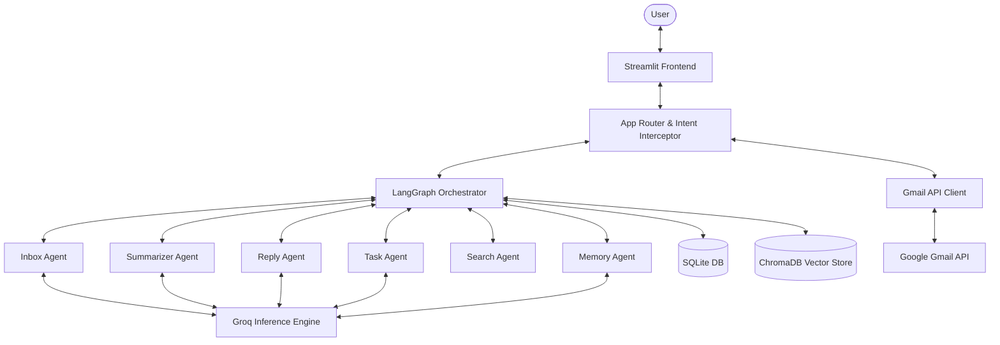
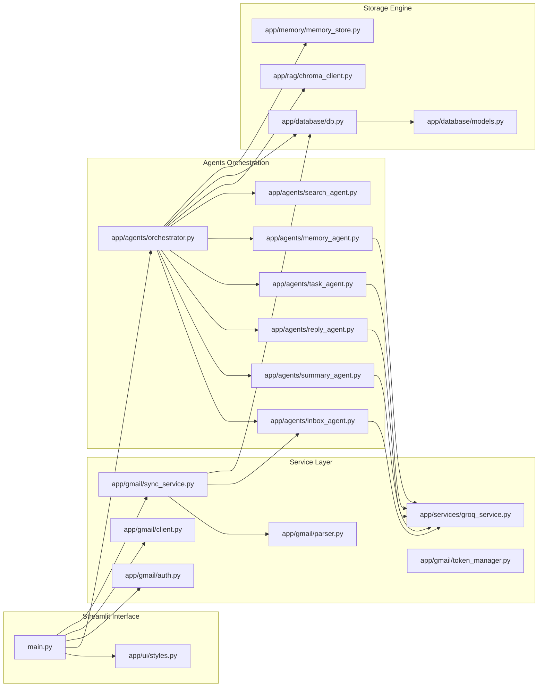
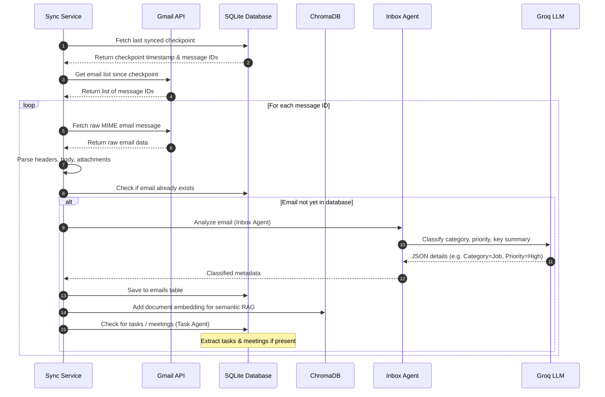
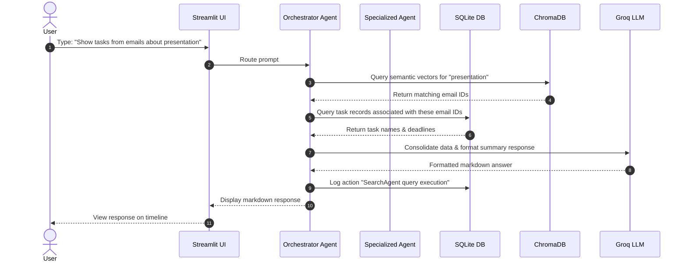
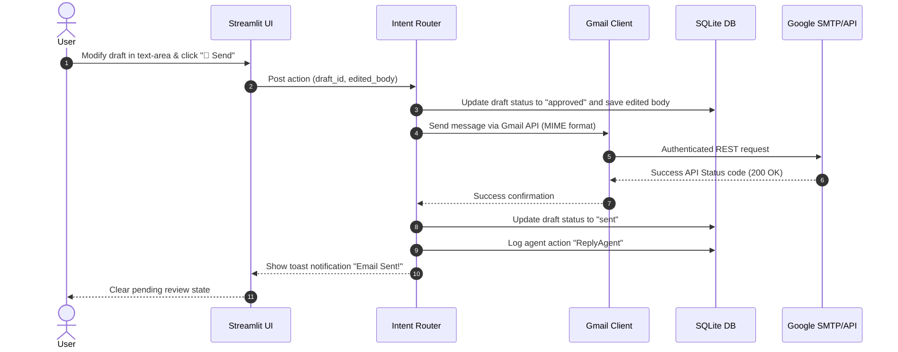
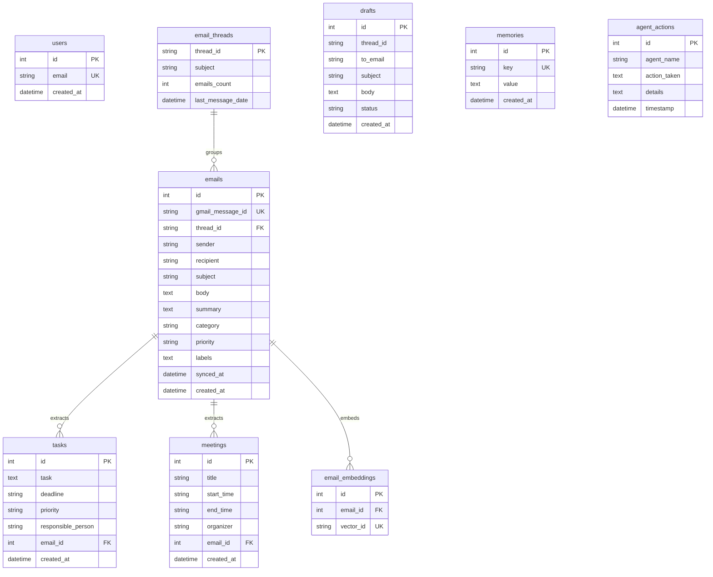

# 🤖 AI Inbox Copilot
### Enterprise-Grade Multi-Agent AI Inbox Orchestrator & Conversational Assistant

[](https://opensource.org/licenses/MIT)
[](https://www.python.org/)
[](https://streamlit.io/)
[](https://github.com/langchain-ai/langgraph)
[](https://groq.com/)
[](https://sqlite.org/)
[](https://www.trychroma.com/)

AI Inbox Copilot is a local portfolio-grade Multi-Agent AI Email Assistant that reads, classifies, prioritizes, searches, summarizes, and drafts replies for Gmail inboxes. Built with Streamlit, LangGraph, Groq, SQLite, and ChromaDB, it functions like **ChatGPT + Gmail + AI Agents**, presenting a clean single-page chat room to query, organize, and automate your inbox while keeping a human-in-the-loop for approvals.

---

## 📖 Table of Contents
1. [Project Overview](#project-overview)
2. [Problem Statement](#problem-statement)
3. [Solution](#solution)
4. [Features](#features)
5. [Architecture & System Design](#architecture--system-design)
    - [High-Level Architecture](#high-level-architecture)
    - [Component Diagram](#component-diagram)
    - [Email Synchronization Flow](#email-synchronization-flow)
    - [Orchestrated Request Flow](#orchestrated-request-flow)
    - [AI Reply & Approval Flow](#ai-reply--approval-flow)
6. [Tech Stack](#tech-stack)
7. [Folder Structure](#folder-structure)
8. [Database Design](#database-design)
    - [Entity-Relationship Diagram](#entity-relationship-diagram)
    - [Database Schemas](#database-schemas)
9. [AI Agents System](#ai-agents-system)
    - [Orchestrator (LangGraph)](#orchestrator-langgraph)
    - [Inbox Agent](#inbox-agent)
    - [Summary Agent](#summary-agent)
    - [Reply Agent](#reply-agent)
    - [Task Agent](#task-agent)
    - [Search Agent](#search-agent)
    - [Memory Agent](#memory-agent)
10. [Security & Token Storage](#security--token-storage)
11. [Installation Guide](#installation-guide)
12. [Environment Variables](#environment-variables)
13. [Performance Considerations](#performance-considerations)
14. [Future Roadmap](#future-roadmap)
15. [License](#license)

---

## 🌟 Project Overview

### What problem the product solves
Modern knowledge workers spend hours per day checking their email. The sheer volume of incoming messages results in cognitive overload, fragmented focus, and delayed responses. Important communications—such as job opportunities, time-sensitive invoices, calendar invites, and critical project updates—are easily lost in a flood of newsletters, transactional updates, and promotional spam.

### Why existing email workflows are inefficient
Existing email clients rely on primitive workflows:
- **Manual Folders/Labels**: Require users to constantly drag-and-drop messages, which breaks focus.
- **Keyword Search**: Extremely brittle; searching for "invoice" might miss an email saying "here is the bill."
- **Unstructured Information**: Emails contain action items, dates, and contacts, but these remain locked in prose.
- **Delayed Replies**: Drafting professional, context-rich replies manually takes minutes per message.

### How AI Inbox Copilot helps users manage Gmail
AI Inbox Copilot introduces a conversational, agentic layer on top of Gmail:
1. **Semantic Understanding**: It processes and catalogs email content beyond keywords, mapping meaning using embedding vectors.
2. **Autonomous Multi-Agent Analysis**: A battery of specialist LLM agents work in parallel to categorize, extract tasks, schedule meetings, detect job leads, and flag urgency.
3. **Conversational Interface**: Users can ask natural language questions (e.g., *"What is the status of the marketing presentation review?"* or *"Summarize today's urgent messages"*).
4. **Draft-Review Loop**: The system drafts replies using personalized memory and past email context, showing them in a beautiful UI for human modification, approval, or discarding.

---

## ⚠️ Problem Statement

Modern enterprise inbox management suffers from several major structural issues:
- **Email Overload**: The volume of incoming data exceeds human processing capabilities, causing communication bottlenecks.
- **Missed Critical Alerts**: A lack of smart prioritization means high-urgency client requests are treated with the same visual weight as low-value updates.
- **Manual Categorization**: Traditional filter rules are static, regex-based, and fail to understand semantic context.
- **Slow Email Response Latency**: Delayed business communications lead to lost prospects and delayed project velocity.
- **Buried Action Items**: Tasks and calendar events described in email text go unrecorded, resulting in missed deadlines.

---

## 💡 Solution

**AI Inbox Copilot** acts as a virtual executive assistant directly embedded into your inbox. 

It connects to your Gmail via a secure OAuth portal, regularly synchronizes your messages, parses threads, and uses a collaborative multi-agent architecture to classify data and execute operations. By combining the structured querying capabilities of SQL databases with the semantic capabilities of vector stores (ChromaDB), it bridges the gap between raw emails and action-oriented intelligence.

```
       +------------------+
       |   Gmail Inbox    |
       +--------+---------+
                | (Secure OAuth Sync)
                v
  +-------------+-------------+
  |    AI Inbox Copilot       |
  |  +---------------------+  |
  |  | Multi-Agent Engine  |  | <---> ChromaDB (Semantic Vector Store)
  |  +---------------------+  |
  |  | SQLite Cache Engine |  | <---> Relational Data (Users, Threads, Tasks)
  |  +---------------------+  |
  +-------------+-------------+
                |
                v
  +-------------+-------------+
  |    Conversational UI      | <---> User reviews drafts, queries summaries,
  |    (Streamlit Web App)   |       and interacts with Copilot.
  +---------------------------+
```

---

## ⚡ Features

### 🔐 Gmail OAuth Integration
Integrates directly with Google's API Console using OAuth 2.0 Client credentials. It safely negotiates refresh tokens, enabling background synchronization and authenticated sending without ever asking for your primary Google account password.

### 🔄 Inbox Synchronization
Performs lightning-fast, incremental syncs. It uses local database checkpoints (`synced_at`) to identify which messages have already been parsed and embedded, fetching only new arrivals to minimize API queries.

### 📝 AI Email Summarization
Summarizes long, messy threads into concise, readable digests. It lists the main topics discussed, current decisions, and pending questions, giving you absolute clarity in seconds.

### 🚨 Urgent Email Detection
Applies natural language analysis to assess message tone and content. If a message contains tight deadlines, escalated issues, or high-value business, it tags it as **High Priority** and surfaces it directly to the dashboard.

### 📅 Meeting & Calendar Event Extraction
Scans incoming messages for dates, times, time zones, organizers, and topics. It parses these into structured database records (`meetings`) ready to be reviewed.

### 💼 Job Opportunity Detection
Identifies recruiter emails, job descriptions, application confirmations, and scheduling requests, categorizing them and tracking roles and entities.

### 🧾 Invoice & Receipt Detection
Detects billing, subscriptions, invoices, and payments, extracting the amount, vendor, due date, and reference codes into structured database schemas.

### 💬 AI Inbox Chat (Orchestrator)
Provides a conversational room powered by a LangGraph orchestrator agent. You can write custom queries like *"Did John send me the updated contract?"* or *"Draft a polite rejection letter for the freelance candidate."*

### 🔍 Smart Semantic & Relational Search
Combines SQL queries (filtering by sender, date range, priority) with semantic vector search (ChromaDB) to locate emails based on meaning, even if specific keywords are absent.

### ✍️ Human-in-the-Loop Draft Approval Workflow
The Reply Agent writes draft emails using Groq. The draft is staged in a review queue (`drafts`) status: `pending_approval`. The user reviews it in a popup modal, edits it in real-time, and hits "Send" (which dispatches it via Gmail API) or "Discard".

---

## 🏗️ Architecture & System Design

### High-Level Architecture



### Component Diagram



### Email Synchronization Flow



### Orchestrated Request Flow



### AI Reply & Approval Flow



---

## 🛠️ Tech Stack

- **Frontend**: [Streamlit](https://streamlit.io/) — Single-page dashboard application. Renders tables, timelines, and custom CSS elements.
- **Agent Orchestrator**: [LangGraph](https://github.com/langchain-ai/langgraph) — Orchestrates routing and state workflows through a directional cyclic graph structure.
- **Language Models API**: [Groq](https://groq.com/) — High-speed API accessing Llama-3 models.
- **Relational Cache**: [SQLite](https://sqlite.org/) — Local embedded relational database. Integrates with Python via [SQLAlchemy ORM](https://www.sqlalchemy.org/).
- **Vector Search Engine**: [ChromaDB](https://www.trychroma.com/) — Embeds email message content to execute nearest-neighbor queries.
- **Embeddings Model**: `SentenceTransformers` (`all-MiniLM-L6-v2`) / LangChain HuggingFace Embeddings — Light-weight model running locally.
- **Email Connection**: [Gmail REST API](https://developers.google.com/gmail/api) — Communicates via official Google APIs client library (`google-api-python-client`).
- **Authorization**: [Google OAuth 2.0](https://developers.google.com/identity/protocols/oauth2) — Direct local credential token creation and automatic refreshing flow.

---

## 📁 Folder Structure

The project matches the following layout on disk:

```
project-root/
├── app/                        # Main Application Codebase
│   ├── agents/                 # Multi-Agent Framework definitions
│   │   ├── inbox_agent.py      # Incoming email categorizer and prioritizer
│   │   ├── memory_agent.py     # Persistent context memory preference parser
│   │   ├── orchestrator.py     # LangGraph router and orchestration graph
│   │   ├── reply_agent.py      # LLM Draft email responder
│   │   ├── search_agent.py     # Hybrid search orchestrator (SQL + ChromaDB)
│   │   ├── summary_agent.py    # Multi-email summary generator
│   │   └── task_agent.py       # Action-item and meeting schedule parser
│   ├── database/               # Database configuration
│   │   ├── db.py               # Session initialization and CRUD utilities
│   │   └── models.py           # SQLAlchemy Table models
│   ├── gmail/                  # Gmail API Client Layer
│   │   ├── auth.py             # Credentials flow, scopes, and token exchange
│   │   ├── client.py           # Send, reply, list, fetch implementations
│   │   ├── parser.py           # Decoders for multi-part base64 emails
│   │   │   └── token_manager.py# Refreshes and validates OAuth access tokens
│   │   └── sync_service.py     # Batch and incremental inbox synchronization
│   ├── memory/                 # Core logic for semantic fact generation
│   │   └── memory_store.py     # Custom local profile parameters
│   ├── rag/                    # Vector Database operations
│   │   └── chroma_client.py    # Chroma DB collections and lookup utilities
│   ├── services/               # Shared Services
│   │   └── groq_service.py     # Groq API client config and error handling
│   ├── tools/                  # Custom tools for agents
│   │   ├── gmail_tools.py      # Gmail lookup helper wrappers
│   │   ├── memory_tools.py     # User preference helper wrappers
│   │   └── vector_tools.py     # Chroma query tool definitions
│   └── ui/                     # UI components and styling
│       └── styles.py           # Custom CSS injectors and design tokens
├── .env                        # Local environment variables
├── .gitignore                  # Git exclusion rules
├── credentials.json            # Desktop App Google OAuth secrets (Git ignored)
├── emails.db                   # SQLite database (Git ignored)
├── main.py                     # Entry point (Streamlit launcher script)
└── requirements.txt            # System dependencies
```

---

## 🗄️ Database Design

SQLite holds the structured state of the user's Gmail. It uses SQLAlchemy for model declarations.

### Entity-Relationship Diagram



### Database Schemas

Below is the database schema represented in SQLAlchemy Python declarations (from `app/database/models.py`):

```python
from sqlalchemy import Column, Integer, String, Text, DateTime, ForeignKey
from sqlalchemy.orm import declarative_base, relationship
import datetime

Base = declarative_base()

class User(Base):
    __tablename__ = 'users'
    id = Column(Integer, primary_key=True, autoincrement=True)
    email = Column(String(255), unique=True, nullable=False)
    created_at = Column(DateTime, default=datetime.datetime.utcnow)

class EmailRecord(Base):
    __tablename__ = 'emails'
    id = Column(Integer, primary_key=True, autoincrement=True)
    gmail_message_id = Column(String(100), unique=True, index=True, nullable=True)
    thread_id = Column(String(100), index=True, nullable=True)
    sender = Column(String(255), nullable=True)
    recipient = Column(String(255), nullable=True)
    subject = Column(String(255), nullable=False)
    body = Column(Text, nullable=False)
    summary = Column(Text, nullable=True)
    category = Column(String(50), nullable=True)
    priority = Column(String(20), nullable=True)
    labels = Column(Text, nullable=True)  # JSON-serialized list of labels
    synced_at = Column(DateTime, default=datetime.datetime.utcnow)
    created_at = Column(DateTime, default=datetime.datetime.utcnow)

    tasks = relationship("TaskRecord", back_populates="email", cascade="all, delete-orphan")
    meetings = relationship("MeetingRecord", back_populates="email", cascade="all, delete-orphan")

class EmailThread(Base):
    __tablename__ = 'email_threads'
    thread_id = Column(String(100), primary_key=True)
    subject = Column(String(255), nullable=True)
    emails_count = Column(Integer, default=1)
    last_message_date = Column(DateTime, default=datetime.datetime.utcnow)

class TaskRecord(Base):
    __tablename__ = 'tasks'
    id = Column(Integer, primary_key=True, autoincrement=True)
    task = Column(Text, nullable=False)
    deadline = Column(String(100), nullable=True)
    priority = Column(String(20), nullable=True)
    responsible_person = Column(String(100), nullable=True)
    email_id = Column(Integer, ForeignKey('emails.id'), nullable=True)
    created_at = Column(DateTime, default=datetime.datetime.utcnow)

    email = relationship("EmailRecord", back_populates="tasks")

class MeetingRecord(Base):
    __tablename__ = 'meetings'
    id = Column(Integer, primary_key=True, autoincrement=True)
    title = Column(String(255), nullable=False)
    start_time = Column(String(100), nullable=True)
    end_time = Column(String(100), nullable=True)
    organizer = Column(String(255), nullable=True)
    email_id = Column(Integer, ForeignKey('emails.id'), nullable=True)
    created_at = Column(DateTime, default=datetime.datetime.utcnow)

    email = relationship("EmailRecord", back_populates="meetings")

class DraftRecord(Base):
    __tablename__ = 'drafts'
    id = Column(Integer, primary_key=True, autoincrement=True)
    thread_id = Column(String(100), nullable=True)
    to_email = Column(String(255), nullable=False)
    subject = Column(String(255), nullable=True)
    body = Column(Text, nullable=False)
    status = Column(String(50), default="pending_approval")
    created_at = Column(DateTime, default=datetime.datetime.utcnow)

class MemoryRecord(Base):
    __tablename__ = 'memories'
    id = Column(Integer, primary_key=True, autoincrement=True)
    key = Column(String(100), unique=True, nullable=False)
    value = Column(Text, nullable=False)
    created_at = Column(DateTime, default=datetime.datetime.utcnow)

class AgentAction(Base):
    __tablename__ = 'agent_actions'
    id = Column(Integer, primary_key=True, autoincrement=True)
    agent_name = Column(String(100), nullable=False)
    action_taken = Column(Text, nullable=False)
    details = Column(Text, nullable=True)
    timestamp = Column(DateTime, default=datetime.datetime.utcnow)
```

---

## 🤖 AI Agents System

AI Inbox Copilot uses modular agent nodes connected via a central LangGraph state graph.

### Orchestrator (LangGraph)
- **File**: `app/agents/orchestrator.py`
- **Purpose**: Defines routing graph and transitions state variables based on intent.
- **Workflow**: 
  1. Activates on user prompt.
  2. Submits state context to `route_intent_node` to determine the target agent.
  3. Transitions state context to the respective specialized agent node.
  4. Returns the agent response to the Streamlit UI.

### Inbox Agent
- **File**: `app/agents/inbox_agent.py`
- **Purpose**: Performs priority evaluation, categorizations, and metadata summarization on sync.
- **Workflow**: Runs on newly fetched emails. Performs classification (e.g. Job, Newsletter, Finance) and extracts priority levels.

### Summary Agent
- **File**: `app/agents/summary_agent.py`
- **Purpose**: Compiles digests of multiple threads or recent emails.
- **Workflow**: Extracts chronological sequences and reduces email texts to concise points.

### Reply Agent
- **File**: `app/agents/reply_agent.py`
- **Purpose**: Generates context-aware, draft email responses.
- **Workflow**: Reads original messages, fetches user memory rules, drafts the email, and adds it to the queue.

### Task Agent
- **File**: `app/agents/task_agent.py`
- **Purpose**: Parses calendar propositions and action items.
- **Workflow**: Extracts task names, deadlines, and meetings, writing them to relational tables.

### Search Agent
- **File**: `app/agents/search_agent.py`
- **Purpose**: Semantic vector query search.
- **Workflow**: Looks up coordinates in ChromaDB and returns similarity sorted lists.

### Memory Agent
- **File**: `app/agents/memory_agent.py`
- **Purpose**: Updates user parameters dynamically.
- **Workflow**: Extracts user habits from chat messages (e.g., *"I prefer formal email tones"*) and stores them in memory.

---

## 🔒 Security & Token Storage

### OAuth Security & Scopes
AI Inbox Copilot connects using Google OAuth 2.0 with a **least-privilege model**:
- `https://www.googleapis.com/auth/gmail.readonly` (reading messages and metadata)
- `https://www.googleapis.com/auth/gmail.send` (sending approved replies)
- `https://www.googleapis.com/auth/gmail.labels` (managing custom priority labels)

### Local Token Storage & Security
Sensitive credentials (such as access tokens, refresh tokens, client IDs, and secrets) are stored locally in the project root within the Git-ignored `token.json` file.
- Access Tokens expire every 3600 seconds, and refresh tokens are used to fetch updates silently.

---

## 🚀 Installation Guide

Follow these steps to set up and run the application locally on your machine.

### Prerequisites
- Python 3.10, 3.11, or 3.12 installed.
- A Google Cloud Console project with the **Gmail API** enabled.
- A **Groq Cloud API Key** (from [Groq Console](https://console.groq.com/)).

### Step 1: Clone the Repository
```bash
git clone https://github.com/bittush8789/ai-inbox-copilot.git
cd ai-inbox-copilot
```

### Step 2: Create a Virtual Environment
* **Windows (PowerShell)**:
```powershell
python -m venv venv
.\venv\Scripts\Activate.ps1
```
* **macOS / Linux**:
```bash
python3 -m venv venv
source venv/bin/activate
```

### Step 3: Install Required Dependencies
```bash
pip install -r requirements.txt
```

### Step 4: Configure Environment Variables
Create a file named `.env` in the root folder of the project:
```env
GROQ_API_KEY=gsk_your_actual_api_key_here
```

### Step 5: Configure Gmail OAuth Credentials
1. Go to the [Google Cloud Console](https://console.cloud.google.com/).
2. Navigate to **APIs & Services > Library**, search for **Gmail API**, and click **Enable**.
3. Navigate to **APIs & Services > OAuth consent screen**. Choose **External**, fill in the required fields, and add `.../auth/gmail.readonly` and `.../auth/gmail.send` scopes.
4. Add your Google account under **Test users**.
5. Navigate to **APIs & Services > Credentials**. Click **Create Credentials > OAuth client ID**.
6. Choose **Desktop app** as the Application Type, name it `AI Inbox Copilot Client`, and click **Create**.
7. Download the JSON credentials file, rename it to `credentials.json`, and place it in the root folder of the project.

### Step 6: Launch the Copilot
```bash
streamlit run main.py
```
Open your browser and navigate to `http://localhost:8501`. Click **Link** in the navigation header to authenticate with Google.

---

## 📄 Environment Variables

Here is a template for the `.env` file:

```env
# Groq API key for Llama 3 inference
GROQ_API_KEY=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
```

---

## ⚡ Performance Considerations

### 1. Incremental Syncing
The application uses checkpoint timestamps (`synced_at`) to fetch only messages received since the last synchronization, avoiding redundant API calls.

### 2. Database Indexing
The SQLite database contains indexes on frequently queried columns, ensuring fast response times as the database grows:
```sql
CREATE INDEX idx_emails_message_id ON emails(gmail_message_id);
CREATE INDEX idx_emails_thread_id ON emails(thread_id);
```

### 3. Semantic Search Cache (ChromaDB)
Embeddings are cached and mapped to email database record IDs, preventing redundant embedding calculations.

---

## 🗺️ Future Roadmap

- [ ] **Multi-Account Gmail Support**: Connect and manage multiple email addresses from a single dashboard.
- [ ] **Outlook Integration**: Support Microsoft 365 Outlook calendars and inboxes.
- [ ] **Advanced RAG Email Search**: Incorporate hybrid keyword and vector search.
- [ ] **Google Calendar Sync**: Automatically synchronize extracted meetings with Google Calendar.
- [ ] **Slack Integration**: Forward high-priority alerts and tasks to Slack.

---

## 📄 License

Distributed under the MIT License. See [LICENSE](LICENSE) for more details.

```
Copyright (c) 2026 AI Inbox Copilot Authors

Permission is hereby granted, free of charge, to any person obtaining a copy
of this software and associated documentation files (the "Software"), to deal
in the Software without restriction, including without limitation the to use,
copy, modify, merge, publish, distribute, sublicense, and/or sell copies of
the Software, and to permit persons to whom the Software is furnished to do so.
```
